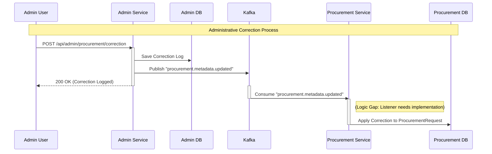
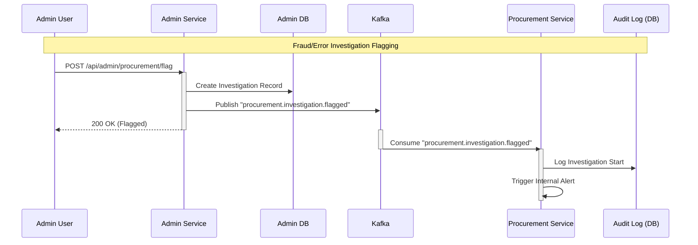

# Interaction and Dependency Analysis: Admin Service & Procurement Service

This analysis details the relationship between the **Admin Service** (Central Administration & Master Data) and the **Procurement Service** (Core Business Logic).

## 1. Summary of Dependencies

| Direction | Dependency Type | Mechanism | Criticality | Description |
| :--- | :--- | :--- | :--- | :--- |
| **Procurement → Admin** | **Logical / Data** | **Implicit / ID Reference** | **High** | Procurement relies on Master Data (Items, Categories) and User/Employee roles defined in Admin. |
| **Admin → Procurement** | **Operational / Oversight** | **Event-Driven (Kafka)** | **Medium** | Admin performs corrections and flags procurement transactions for investigation. |

---

## 2. Procurement Service Dependencies on Admin Service

The Procurement Service is the **consumer** of data standards and organizational structures defined in the Admin Service.

### A. Master Data (Items & Categories)
*   **What data is needed?**: Standardized Item Codes (SKUs), Categories, Units of Measurement (UOM), and potentially Tax configurations.
*   **Why?**: To ensure that a Procurement Request (PR) for "Laptop" aligns with the company's standardized catalog item `ITM-001` rather than free-text entry.
*   **Implementation**:
    *   **Current State**: **Loose Coupling**. The `ProcurementItem` entity stores `vendorCatalogId` and `itemName` but does *not* strictly validate against `admin-service` via API call at runtime.
    *   **Impact of Failure**: If Admin Service is down, Procurement can likely still operate if the frontend provides the correct IDs. However, data consistency relies on the client not sending invalid IDs.
    *   **Source of Truth**: **Admin Service** (`master_data_items`).

### B. User & Organization Hierarchy
*   **What data is needed?**: Operator IDs, Supervisor IDs, Department correctness.
*   **Why?**: To enforce the approval workflow (e.g., "Only a Supervisor in the IT Department can approve this PR").
*   **Implementation**:
    *   The `ProcurementRequestService` uses `operatorId` extracted from the JWT (provided by **Auth Service**).
    *   *Gap*: The code contains a `TODO: Populate names from external services` when publishing events, indicating a missing RPC/Feign call to `admin-service` to resolve names from IDs for notifications.
    *   **Source of Truth**: **Admin Service** (`employees`, `assignments` tables).

---

## 3. Admin Service Dependencies on Procurement Service

The Admin Service acts as an **auditor and supervisor** over the Procurement Service.

### A. Administrative Corrections
*   **What data is needed?**: `procurementId` and the specific field to correct.
*   **Why?**: In case of human error (e.g., wrong cost center allocated) that cannot be fixed via standard workflow, an Admin must intervene.
*   **Implementation**:
    *   **Mechanism**: Admin Service publishes `admin.procurement.metadata.updated` to Kafka topic `procurement.metadata.updated`.
    *   **Observation**: The `ProcurementService` currently **does not have a listener** for this specific topic in `ProcurementEventConsumer.java`. This implies the correction might only be logged for Audit/Reporting purposes in the current build, or is a gap in implementation.
    *   **Source of Truth**: **Procurement Service** owns the transaction data; Admin Service is requesting a change.

### B. Investigation Flags
*   **What data is needed?**: `procurementId`.
*   **Why?**: To mark a suspicious transaction (e.g., potential fraud) for audit.
*   **Implementation**:
    *   **Mechanism**: Admin Service publishes `admin.procurement.investigation.flagged` to Kafka.
    *   **Source of Truth**: The "Flag" status is maintained in **Admin Service** (`audit_investigation_flags` table) but refers to data in Procurement.

---

## 4. Cross-Service Interaction Table

| Interaction | Source Service | Target Service | Method | Payload / Details |
| :--- | :--- | :--- | :--- | :--- |
| **Validate User Role** | Procurement | Auth / Admin | **JWT** | Procurement trusts the `ROLE` claim in the JWT issued by Auth (based on Admin data). |
| **Correction Request** | Admin | Procurement | **Kafka** | Topic: `procurement.metadata.updated`<br>Payload: `{procurementId, field, oldValue, newValue}` |
| **Investigation Flag** | Admin | Procurement | **Kafka** | Topic: `procurement.investigation.flagged`<br>Payload: `{procurementId, reason, flaggedBy}` |
| **Master Data Sync** | Admin | Procurement | **Kafka** | Topic: `admin.masterdata.events`<br>Payload: `{itemId, sku, name, ...}`<br>*(Note: Procurement consumer not yet implemented)* |

## 5. Architecture Diagram

```mermaid
graph TD
    subgraph "Admin Service (Source of Truth)"
        MD[Master Data]
        EMP[Employee/User]
        CORRECT[Correction Service]
    end

    subgraph "Procurement Service (Business Logic)"
        PR[Procurement Request]
        PO[Purchase Order]
        LISTENER[Event Consumer]
    end

    subgraph "Auth Service"
        AUTH[Auth Provider]
    end

    %% Dependencies
    EMP -->|Defines Roles| AUTH
    AUTH -->|Issues JWT| PR
    
    MD -.->|Logical Ref (ID)| PR
    CORRECT -->|Publish: Correction Event| KAFKA{Kafka}
    
    KAFKA -.->|Consume (Pending Impl)| LISTENER
    LISTENER -.->|Update| PR
```

## 6. Recommendations
1.  **Implement Master Data Consumer**: To ensure data integrity, `procurement-service` should listen to `admin.masterdata.events` and replicate essential item data (SKU, Name, Price) to a local cache or validation table.
2.  **Close the Correction Loop**: Implement a listener in `ProcurementEventConsumer` to handle `procurement.metadata.updated` events and actually apply the corrections to the `ProcurementRequest` entity.
3.  **User Name Population**: Implement the `AdminServiceClient` (Feign) in `procurement-service` to fetch user names for email notifications/events as indicated in the code `TODO`.

## 7. Sequence Diagrams

### A. Administrative Correction Flow

This diagram illustrates how an admin corrects data in the procurement service (e.g., fixing a typo or category error).



### B. Investigation Flag Flow

This diagram shows the flow when an admin flags a transaction for investigation.


