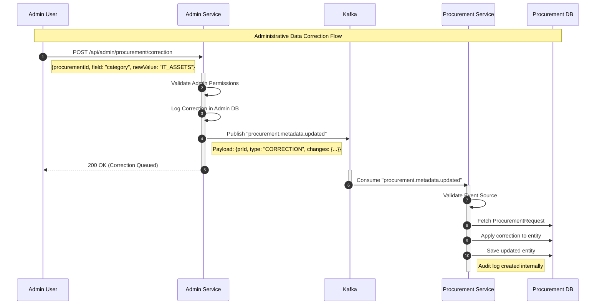
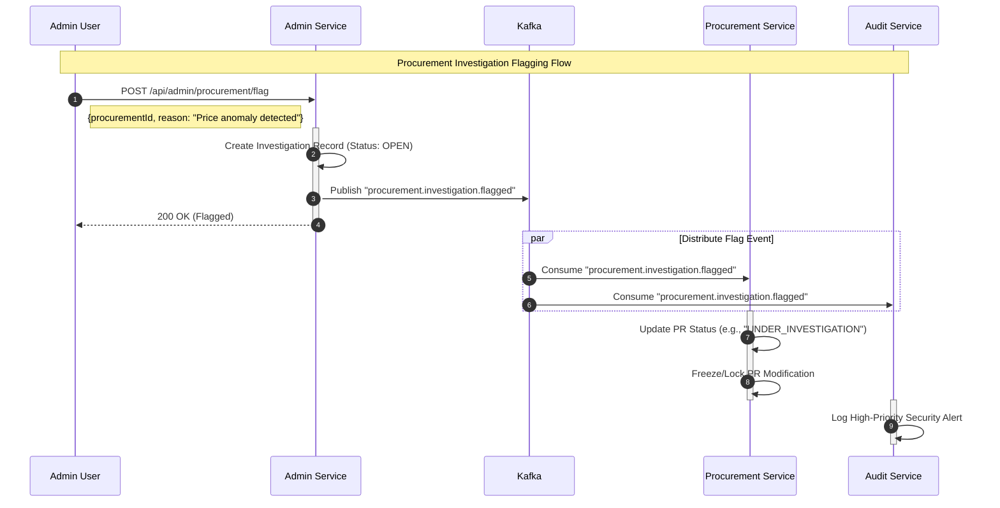
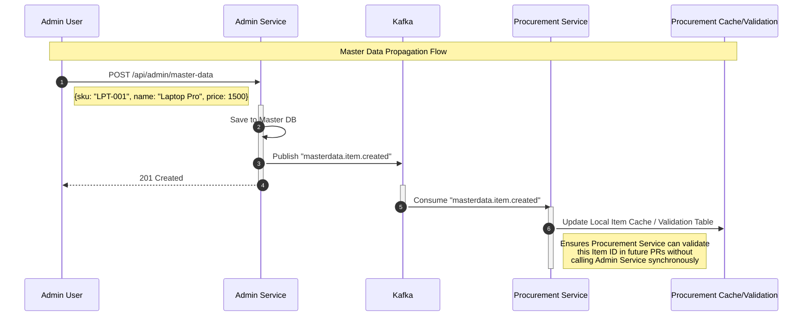
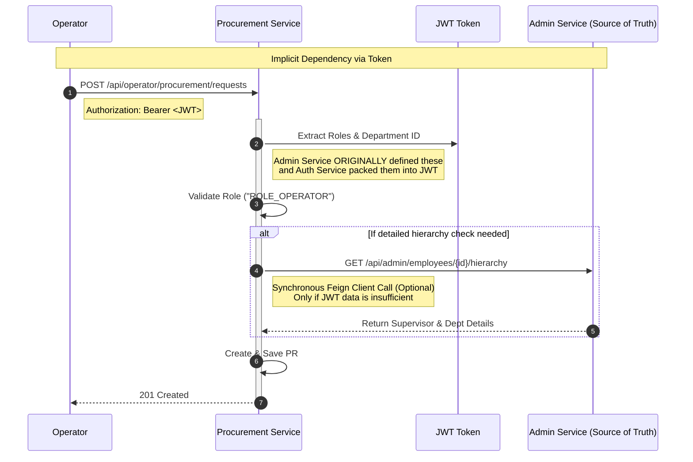

# Admin-Procurement Interaction Sequence Diagrams

This document visualizes the specific interaction flows between the **Admin Service** and **Procurement Service** for each distinct use case.

## 1. Use Case: Administrative Correction
**Scenario**: An Administrator needs to manually correct a field (e.g., misclassified category or typo) in an active Procurement Request that is locked for the Operator.

## 2. Use Case: Investigation Flagging
**Scenario**: An Administrator flags a specific Procurement Request as "Suspicious" or "Under Investigation" due to potential fraud or policy violations.

## 3. Use Case: Master Data Synchronization
**Scenario**: An Administrator adds a new Standard Item to the Master Data catalog. The Procurement Service must become aware of this validity.

## 4. Use Case: User Role & Hierarchy Validation
**Scenario**: An Operator submits a PR. The system must validate they belong to the correct department/hierarchy, which is managed by the Admin Service.

