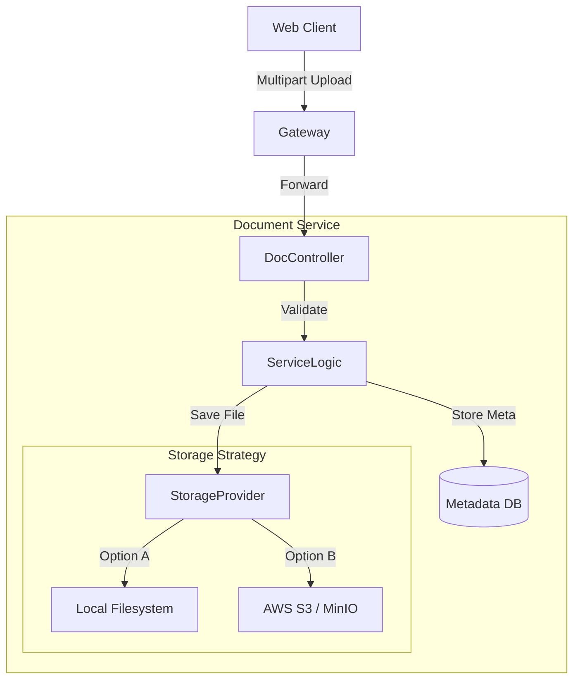

# Document Service - Architecture

## High-Level Diagram



## Component Description

### 1. Document Controller
*   **Role**: Handles HTTP Multipart requests.
*   **Responsibility**:
    *   `POST /upload`: Stream input to storage.
    *   `GET /files/{id}`: Stream output from storage.

### 2. File Storage Service (Interface)
*   **Role**: Abstraction layer for file operations.
*   **Implementations**:
    *   `LocalFileSystemService`: Stores files in a directory (e.g., `/var/storage`). Good for dev/on-prem.
    *   `S3StorageService`: Stores files in object storage. Good for cloud/scalability.

### 3. Metadata Repository
*   **Role**: Stores file attributes.
*   **Data**: Original filename, MIME type, size, uploader ID, upload timestamp.
*   **Why**: File systems don't efficiently store application-level metadata or link it to Users.

## Data Model

### DocumentMetadata Entity
```json
{
  "id": "uuid",
  "originalFilename": "invoice_dec.pdf",
  "storedFilename": "bad876-invoice_dec.pdf",
  "contentType": "application/pdf",
  "size": 1048576,
  "uploaderId": "user-uuid",
  "bucket": "procurement-docs",
  "createdAt": "2025-12-15T10:00:00Z"
}
```
