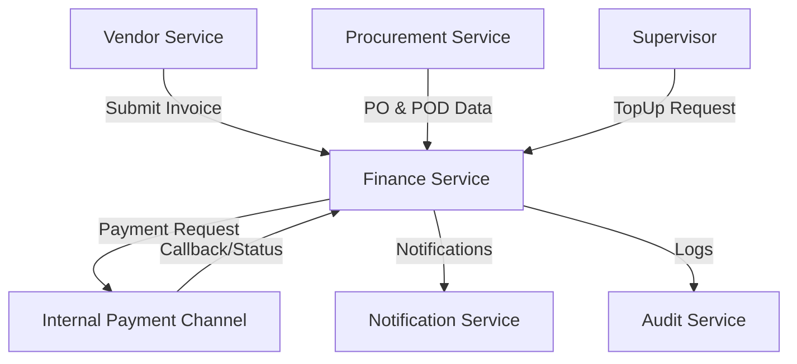

# Finance Service - Architecture & Data Entities

## Component Diagram
The Finance Service interacts with:
- **Procurement Service** (PO Data, POD)
- **Vendor Service** (Invoice Submission, Vendor Info)
- **Notification Service** (Alerts)
- **Audit Service** (Logging)
- **Internal Payment Channel** (Mock/Dummy Banking API)

## Data Entities

### 1. Invoice
Invoice di-generate sistem dari PO/termin; dapat di-re-generate jika ada koreksi.
- `invoice_id` (PK)
- `po_id` (FK to Procurement)
- `vendor_id` (FK to Vendor)
- `nomor_invoice`
- `subtotal`
- `ppn`
- `total`
- `status`: `submitted` | `verified` | `rejected` | `scheduled` | `paid`
- `regenerated_of` (FK to previous Invoice if correction)
- `created_at`

### 2. InvoiceAttachment
Lampiran pendukung (surat jalan, dll).
- `attachment_id` (PK)
- `invoice_id` (FK)
- `file_url`
- `tipe`
- `uploaded_at`

### 3. PaymentValidationTask
Tugas verifikasi invoice dengan SLA 1×24 jam.
- `task_id` (PK)
- `invoice_id` (FK)
- `checklist`: JSON { PO_match, POD_match, Term_match }
- `sla_due_at`
- `result`: `PASS` | `FAIL`
- `notes`

### 4. PaymentTerm
Termin pembayaran jasa.
- `term_id` (PK)
- `po_id` / `contract_id`
- `deskripsi`
- `persentase` / `nominal`
- `due_date`
- `status`

### 5. PaymentSchedule
Jadwal pembayaran yang ditetapkan Finance.
- `schedule_id` (PK)
- `invoice_id` (FK)
- `tanggal_bayar`
- `metode`
- `status`: `scheduled` | `processed` | `failed` | `delayed` | `canceled`

### 6. Payment
Realisasi pembayaran (dummy internal).
- `payment_id` (PK)
- `invoice_id` (FK)
- `amount`
- `metode`
- `reference_no`
- `paid_at`
- `status`

### 7. PaymentReconciliation
Rekonsiliasi dan unggah bukti bayar.
- `recon_id` (PK)
- `payment_id` (FK)
- `bukti_bayar_url`
- `hasil_rekon`
- `catatan`

### 8. Budget
Data anggaran per operator/lokasi.
- `budget_id` (PK)
- `operator_id` / `lokasi_id`
- `periode`
- `nilai_awal`
- `nilai_terpakai`
- `sisa`

### 9. TopUpRequest
Permintaan penambahan saldo operator dari Supervisor.
- `topup_id` (PK)
- `operator_id` (FK)
- `amount`
- `alasan`
- `status`: `submitted` | `approved` | `rejected`
- `decided_at`
- `decided_by`

### 10. CashflowRecord
Catatan arus kas terkait pengadaan (Ledger).
- `record_id` (PK)
- `tanggal`
- `kategori`
- `debit`
- `kredit`
- `saldo_berjalan`
- `referensi` (PO/Invoice ID)

### 11. AnomalyFlag
Penanda anomali keuangan.
- `flag_id` (PK)
- `vendor_id`
- `invoice_id`
- `rule`: `B` | `C` | `D`
- `severity`
- `created_at`
- `resolved_at`

### 12. AuditLogFinance
Jejak audit khusus finance.
- `log_id` (PK)
- `user_id`
- `aksi`
- `objek`
- `timestamp`
- `keterangan`
