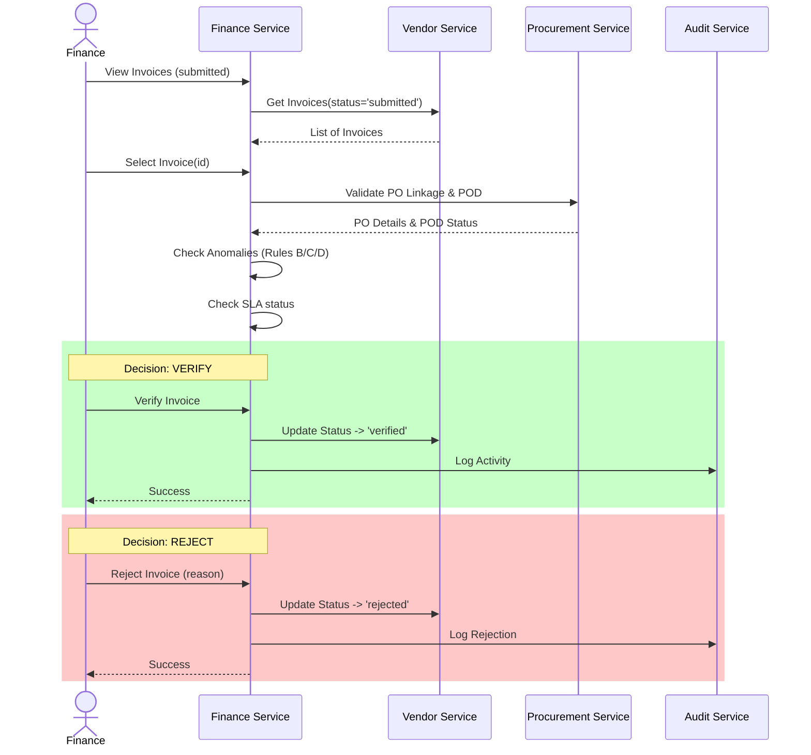
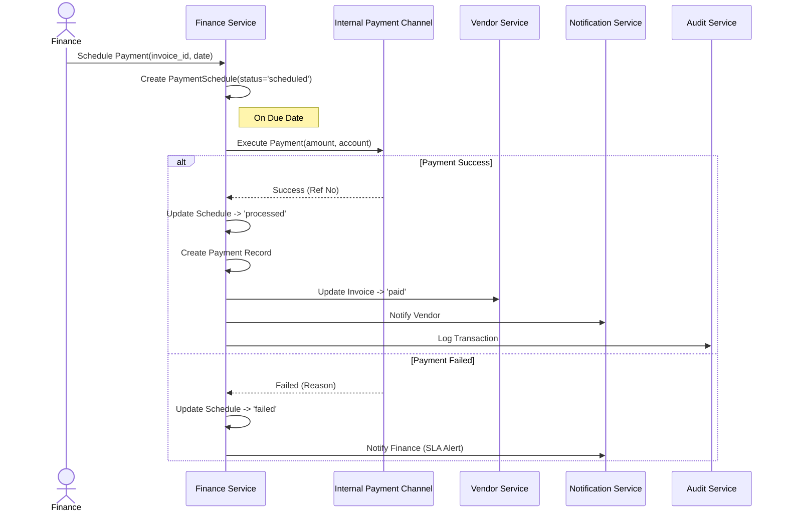
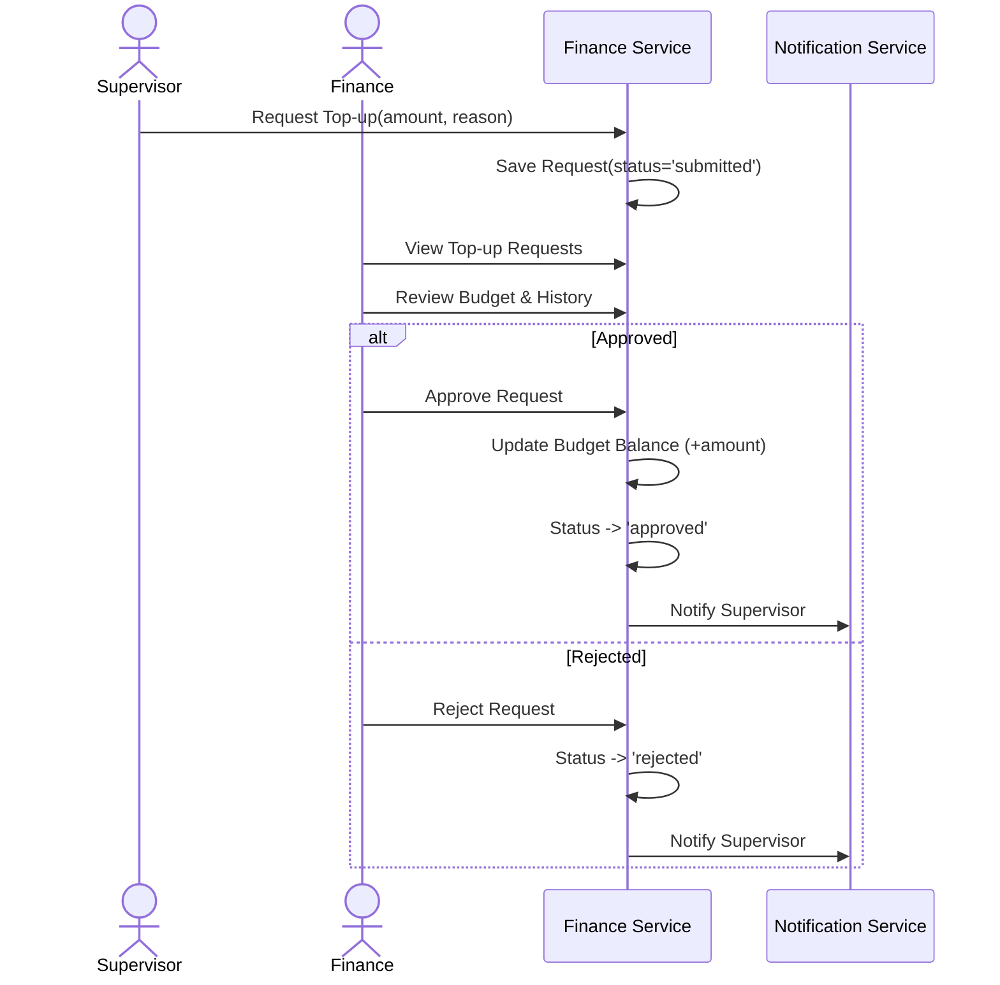

# Finance Service - Use Cases

## 1. Verifikasi Dokumen Pembayaran (Invoice)

**Actor**: Finance
**Description**: Finance memverifikasi invoice yang di-generate sistem berdasarkan PO/termin, mencocokkan dengan bukti penerimaan (POD) dan kontrak/termin jasa. Jika tidak sesuai, Finance menolak (reject) dan vendor melakukan koreksi dokumen; sistem kemudian melakukan re-generate invoice yang baru.

### Pre-conditions
1. Invoice berstatus `submitted` dari Vendor Service.
2. Data PO dan POD tersedia di Procurement Service.
3. Untuk jasa, termin/ProgressReport tersedia dan berstatus `valid`.

### Post-conditions
1. Invoice terverifikasi (`verified`) atau ditolak (`rejected`) dengan alasan.
2. Jika verified, siap dibuat `PaymentSchedule`.
3. Audit dan notifikasi terkirim.

### Basic Flow
1. Finance membuka modul “Verifikasi Invoice”.
2. Sistem menampilkan daftar invoice `submitted` dengan SLA verifikasi 1×24 jam (penanda due by).
3. Finance memilih satu invoice.
4. Sistem menampilkan ringkasan verifikasi: PO linkage, POD/DeliveryProof, termin (bila jasa), rincian nilai (subtotal, PPN, total).
5. Sistem menjalankan cek otomatis:
    - a) Kecocokan nilai total dengan PO/termin.
    - b) Keberadaan & kesesuaian POD.
    - c) Status termin (bila jasa).
6. Sistem menjalankan deteksi anomali:
    - **B**: Frekuensi invoice vendor > 3 dalam 24 jam.
    - **C**: Total invoice > 2× rata-rata nilai PO vendor.
    - **D**: Mismatch termin/total invoice ≠ PO.
7. Finance meninjau hasil cek & indikator anomali.
8. Finance memilih keputusan: **Verify** atau **Reject**.
9. Jika **Verify**: Sistem mengubah status invoice → `verified` dan membuat `PaymentValidationTask.result = PASS`.
10. Sistem mencatat audit dan mengirim notifikasi ke pihak terkait.

#### Sequence Diagram: Verifikasi Invoice

### Alternative Flows
**A1: Override Anomali**
1. Invoice terindikasi anomali (B/C/D) tapi data valid.
2. Finance meninjau manual dan tetap verify.
3. Sistem menyimpan catatan alasan override dalam `AnomalyFlag`.

**A2: SLA Reminder**
1. Invoice belum diverifikasi hingga mendekati SLA.
2. Sistem mengirim pengingat otomatis ke dashboard/email Finance.

**A3: Re-generate setelah Reject**
1. Finance memilih **Reject** dan mengisi alasan.
2. Sistem mengubah status invoice → `rejected` dan notifikasi ke Vendor.
3. Vendor koreksi dokumen di portal.
4. Sistem re-generate invoice (nomor baru, `regenerated_of` = old `invoice_id`).
5. Invoice baru masuk antrian `submitted`.

### Error Flows
**E1: Data PO/POD tidak ditemukan**
- Sistem menampilkan "Data referensi tidak tersedia". Status pending, SLA berjalan.

**E2: Gangguan sinkronasi termin jasa**
- Cek termin inconclusive. Finance diminta tunda atau reject.

**E3: Audit Service timeout**
- Log disimpan lokal sementara, retry background.

---

## 2. Mengelola Proses Pembayaran Vendor

**Actor**: Finance
**Description**: Finance melakukan penjadwalan dan pemrosesan pembayaran kepada vendor. Pembayaran dilakukan melalui kanal internal (dummy `InternalPaymentChannel`).

### Pre-conditions
1. Invoice berstatus `verified`.
2. Data rekening vendor tersedia (Vendor Service).

### Post-conditions
1. `PaymentSchedule` tercipta.
2. Pembayaran terlaksana (`processed`).
3. Status invoice updated.
4. Rekonsiliasi tercatat.

### Basic Flow
1. Finance membuka modul “Pembayaran Vendor”.
2. Sistem menampilkan invoice `verified`.
3. Finance memilih invoice.
4. Sistem menampilkan detail (nilai, vendor, PO, termin).
5. Finance menekan “Jadwalkan Pembayaran”.
6. Sistem menampilkan form (tanggal, metode).
7. Finance input tanggal dan simpan.
8. Sistem membuat `PaymentSchedule` status `scheduled`.
9. Pada hari H, sistem eksekusi ke `InternalPaymentChannel`.
10. Status berubah `processed`.
11. Sistem buat entitas `Payment` (reference dummy).
12. Notifikasi ke Vendor & Supervisor.
13. Audit log tercatat.

### Alternative Flows
**A1: Bayar Sekarang**
- Finance pilih "Bayar Sekarang", sistem cek anggaran, langsung eksekusi.

**A2: Penundaan (Delay)**
- Finance ubah status `delayed` dengan alasan. Vendor ternotifikasi.

**A3: Pembatalan**
- Finance status `canceled` sebelum eksekusi.

**A4: Pembayaran Termin Jasa**
- Sistem deteksi termin, pembayaran hanya untuk termin tersebut.

### Error Flows
**E1: Koneksi Payment Channel Gagal**
- Status `failed`. Opsi Retry/Delay.

**E2: Anggaran Tidak Cukup**
- Sistem tolak pembayaran. Opsi: Minta Top-up atau Tunda.

**E3: Rekening Vendor Invalid**
- Sistem tolak, minta update data.

#### Sequence Diagram: Pembayaran Vendor

---

## 3. Memantau Anggaran dan Arus Kas

**Actor**: Finance
**Description**: Monitoring realisasi anggaran (per lokasi/operator/proyek) vs alokasi, serta arus kas.

### Basic Flow
1. Finance buka modul “Anggaran & Arus Kas”.
2. Dashboard: Anggaran awal, terpakai, sisa, proyeksi.
3. Finance pilih filter (lokasi/proyek).
4. Sistem tampilkan detail transaksi (PO/Invoice/Debit/Kredit).
5. Sistem hitung total & tren bulanan.
6. Sistem deteksi anomali (B/C/D rules).
7. Finance tinjau.

### Alternative Flows
**A3: Simulasi Proyeksi**
- Sistem hitung estimasi sisa akhir bulan.
- Rekomendasi Top-up jika kurang.

---

## 4. Membuat Laporan Keuangan

**Actor**: Finance
**Description**: Generate laporan (PDF/Excel) untuk transaksi, realisasi anggaran, outstanding payment, audit.

### Basic Flow
1. Modul “Laporan Keuangan”.
2. Pilih jenis laporan.
3. Filter (Periode, Vendor, Kategori).
4. Generate.
5. Export PDF/Excel.

### Alternative Flows
**A1: Scheduled Report**
- Set jadwal (harian/mingguan). Sistem auto-generate & email.

---

## 5. Menambah/Menyesuaikan Saldo Operator (Top-Up Request)

**Actor**: Finance
**Description**: Approval permintaan top-up dari Supervisor.

### Basic Flow
1. Modul “Permintaan Top-Up”.
2. Pilih request `submitted`.
3. Review detail (alasan, sisa saldo, history).
4. Aksi: **Setujui** atau **Tolak**.
5. Jika Setujui: Saldo operator bertambah, status `approved`.
6. Notifikasi ke Supervisor.

#### Sequence Diagram: Top-up Anggaran

### Alternative Flows
**A1: Adjust Nilai**
- Finance ubah nilai top-up (lebih rendah). Konfirmasi.

---

## 6. Melihat Audit Trail

**Actor**: Finance
**Description**: Melihat history aktivitas keuangan.

### Basic Flow
1. Modul Audit Trail.
2. Filter (Waktu, User, Vendor, Event).
3. View detail log.

---

## 7. Menerima Alert & Notifikasi

**Actor**: Finance
**Description**: Dashboard notifikasi untuk invoice baru, SLA, payment failed, anomaly, over budget.
