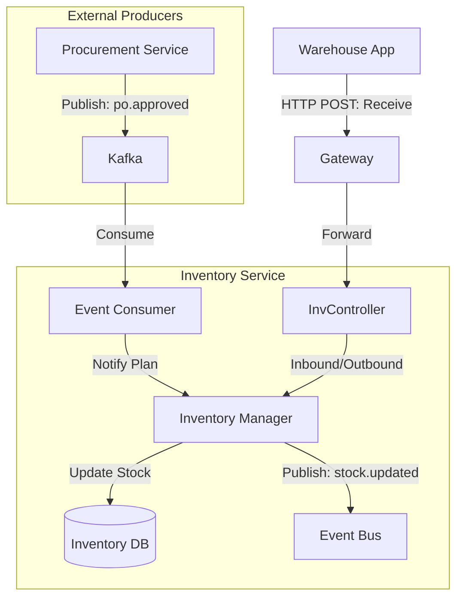

# Inventory Service - Architecture

## High-Level Diagram

Inventory Service listens to Procurement events to anticipate incoming stock and emits events when stock changes.

## Data Model

### InventoryItem (Stock)
*   `id`: UUID
*   `sku`: String (Link to Master Data)
*   `locationId`: UUID
*   `quantity`: Integer
*   `reserved`: Integer (Committed but not shipped)
*   `minThreshold`: Integer

### TransactionHistory (Ledger)
*   `id`: UUID
*   `sku`: String
*   `change`: +10 / -5
*   `reason`: `PO_RECEIVABLE` | `ISSUANCE` | `ADJUSTMENT`
*   `referenceId`: PO-123 / DO-456
*   `timestamp`: Timestamp
