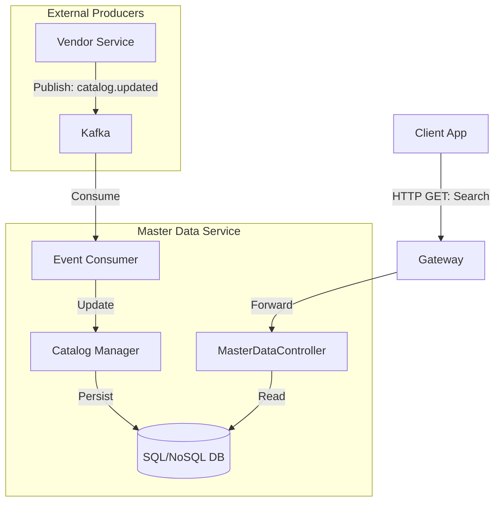

# Master Data Service - Architecture

## High-Level Diagram

Master Data acts as a Read-Heavy service. It aggregates catalog data from Vendors for easy searching by Procurement users.

## Data Model

### GlobalCatalogItem
*   `id`: UUID
*   `sku`: String
*   `name`: String
*   `category`: String
*   `vendorId`: UUID
*   `price`: Decimal
*   `lastUpdated`: Timestamp

### Location
*   `id`: UUID
*   `name`: String
*   `address`: String
*   `type`: `WAREHOUSE` | `OFFICE` | `PROJECT_SITE`

### CostCenter
*   `id`: UUID
*   `code`: String
*   `name`: String
*   `budgetLimit`: Decimal (Optional linkage to Finance)
