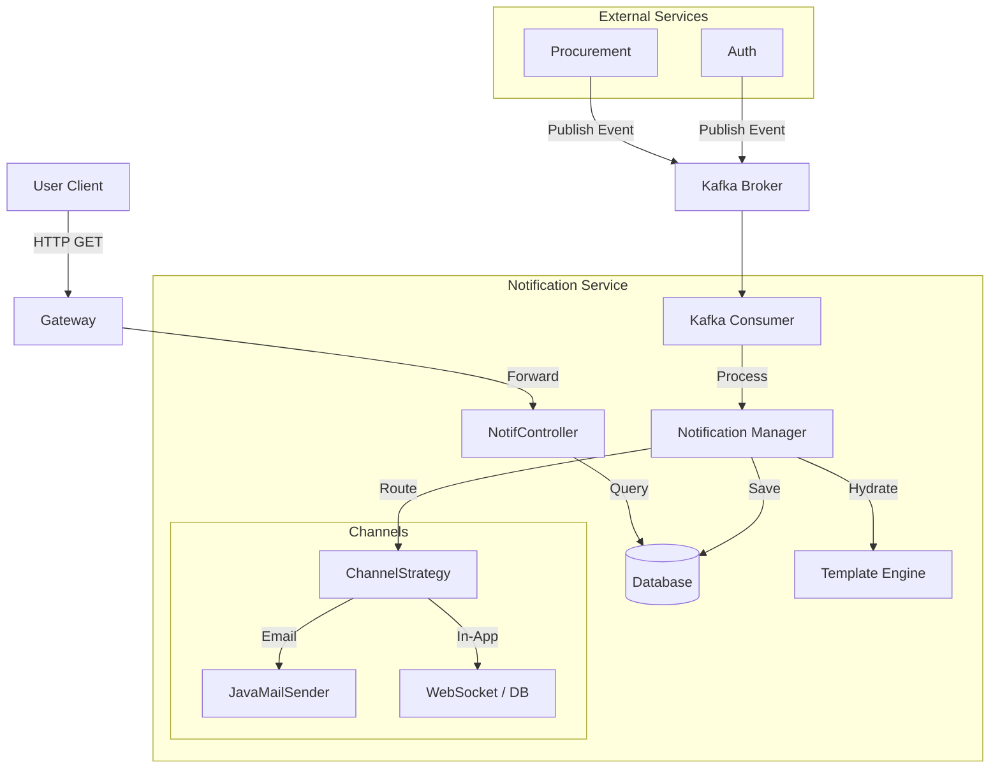

# Notification Service - Architecture

## High-Level Diagram

## Component Description

### 1. Notification Listener (Consumer)
*   **Role**: Listens for events like `user.registered` or `po.approved`.
*   **Responsibility**: Converts domain events into notification tasks.

### 2. Template Engine
*   **Technology**: Thymeleaf or FreeMarker.
*   **Responsibility**: Merges variables (e.g., `{{userName}}`) with HTML templates.

### 3. Channel Strategy
*   **Design Pattern**: Strategy Pattern.
*   **Implementations**:
    *   `EmailChannel`: Uses SMTP (Gmail/SendGrid/AWS SES).
    *   `InAppChannel`: Stores in DB for the endpoint `GET /notifications`.
    *   `Slack/Teams`: (Future extension).

### 4. Database
*   **Technology**: PostgreSQL or MongoDB.
*   **Schema**:
    *   `Notification`: { id, userId, title, body, isRead, type, createdAt }

## Data Flow
1.  **Input**: Kafka Message `{ "type": "PO_APPROVAL", "userId": "123", "data": { "poNumber": "PO-999" } }`
2.  **Processing**: Lookup User Preferences -> Load Template -> Generate Body.
3.  **Delivery**: Send Email async -> Save to DB.
