# Procurement Service Use Cases

## 1. Operator Use Cases

### 1.1 Submit Goods Procurement (Mengajukan Pengadaan Barang)
**Description**: The process where an Operator requests goods through a multi-step form (Header -> Item -> Delivery -> Document -> Summary) and submits it for Supervisor approval.
**Actor**: Operator
**Pre-conditions**:
1. Operator is logged in.
2. Active Vendor data is available.
3. Vendor Catalog is available.
4. Operator's location is registered.

**Basic Flow**:
1.  **Header**:
    *   Operator selects a Vendor.
    *   System validates Vendor Catalog availability.
    *   Operator fills Description, Priority (Normal/Urgent/Critical), and Deadline.
2.  **Item**:
    *   System loads Vendor Catalog.
    *   Operator selects items and sets quantity.
    *   System calculates subtotal and tax.
3.  **Delivery**:
    *   System defaults to Operator's location.
    *   Operator confirms/edits address and expected delivery date.
4.  **Document**:
    *   System generates auto-documents.
    *   Operator uploads additional documents if needed.
5.  **Summary & Submission**:
    *   system shows summary.
    *   Operator clicks "Submit for Approval".
    *   System sets status to `SUBMITTED`.
    *   System notifies Supervisor.
    *   Activity is audited.

**Alternative Flows**:
*   **A1 Save as Draft**: Operator saves progress to edit later.
*   **A2 No Catalog**: If vendor has no active catalog, system warns and prompts to select another vendor.
*   **A3 Auto-Reminder**: If Supervisor takes no action for 24h, system sends reminder.
*   **A4 Escalation**: If Supervisor takes no action for 48h, system escalates to Admin.

**Error Flows**:
*   **E1 Incomplete Data**: Missing description or deadline.
*   **E2 Invalid Quantity**: 0 or excessive quantity.
*   **E3 Load Failure**: Catalog fails to load.
*   **E4 Upload Failure**: Invalid file type or size.

**Sequence Diagram**:
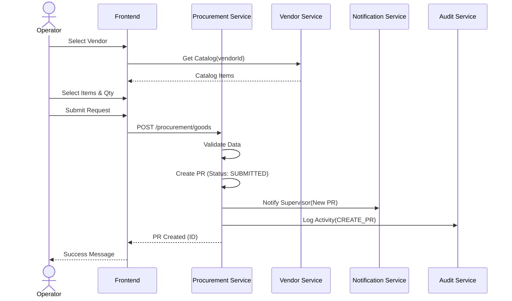
*   **E5 Notification Failure**: Notification to Supervisor failed (Auto-retry).
*   **E6 Save Failure**: Failed to save data to database.

---

### 1.2 Submit Service Procurement (Melakukan Pengadaan Jasa)
**Description**: The process for requesting services, involving scope selection, payment terms, scheduling, and documents.
**Actor**: Operator

**Basic Flow**:
1.  **Header**: Select Vendor, fill Description, Priority, Deadline.
2.  **Scope**: Select service scope (e.g., Installation, Maintenance) from Vendor offerings; add technical details.
3.  **Terms**: Select payment terms (e.g., DP 30%, Progress 40%) if applicable, or "No Terms". Input duration.
4.  **Delivery (Schedule)**: Confirm location, set Start and End dates.
5.  **Document**: Auto-generated docs + optional Operator uploads.
6.  **Summary & Submission**: Submit for Supervisor approval.

**Sequence Diagram**:
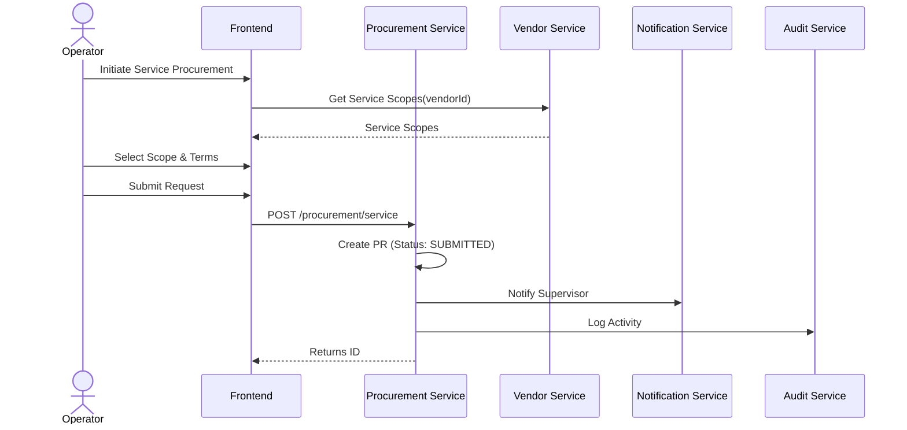

**Alternative Flows**:
*   **A1 Save as Draft**.
*   **A2 Vendor has no services**: Warning displayed.
*   **A3 Terms not available**: Prompt to select valid term or 'No Terms'.
*   **A5 Escalation**: 48h escalation to Admin.

**Error Flows**:
*   **E1 Incomplete Data**: Description or Scope missing.
*   **E2 Scope Load Failure**: Service Scope fails to load from Vendor Service.
*   **E3 Upload Failure**: File too large or invalid format.
*   **E4 Invalid Date**: Start Date > End Date or after Deadline.

---

### 1.3 Review Service Terms (Peninjauan Tawaran Termin Jasa)
**Description**: Operator reviews terms proposed by a Vendor for a service request (phases, duration, cost, deliverables).
**Pre-conditions**: Vendor has submitted terms; Request is in "Submitted by Vendor" state.

**Basic Flow**:
1.  Operator views proposed terms (value, scope, timeline, deliverables).
2.  Operator clicks "Approve Terms" (Review-level).
3.  System updates status to `REVIEWED_BY_OPERATOR` and notifies Supervisor.

**Sequence Diagram**:
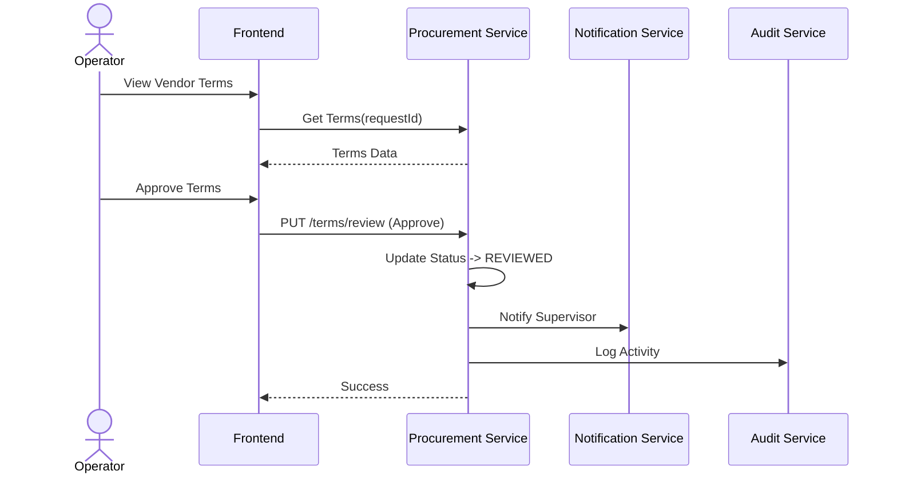

**Alternative Flows**:
*   **A1 Clarification**: Operator requests clarification. Status -> `CLARIFICATION_REQUESTED`.
*   **A2 Revision**: Operator requests revision. Status -> `REVISION_REQUESTED`.

**Error Flows**:
*   **E1 Already Processed**: Term has already been processed by Supervisor.
*   **E2 Missing Notes**: Revision/Clarification notes are empty.
*   **E3 Doc Access Failure**: Supporting documents cannot be accessed.
*   **E4 Status Save Failure**: Failed to update status.

---

### 1.4 Confirm Service Results (Melakukan Konfirmasi Hasil Jasa)
**Description**: Operator verifies that the service has been completed according to scope and terms.
**Pre-conditions**: Vendor marked service/term as completed; Vendor sent report.

**Basic Flow**:
1.  Operator views "Waiting for Confirmation" terms.
2.  Operator reviews Vendor's report and evidence.
3.  Operator clicks "Confirm Service Result".
4.  Operator enters confirmation notes.
5.  System updates status to `COMPLETED`/`VERIFIED`.
6.  System notifies Finance for payment.
7.  System updates Inventory (if applicable).

**Sequence Diagram**:
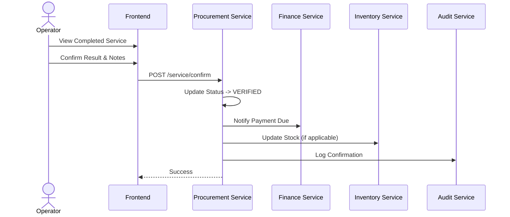

**Alternative Flows**:
*   **A2 Request Revision**: Operator rejects result, requests revision. Status -> `REVISION_REQUESTED`.

**Error Flows**:
*   **E1 Empty Notes**: Confirmation notes are missing.
*   **E2 Doc Access Failure**: Vendor report cannot be accessed.
*   **E3 Save Failure**: Failed to save confirmation.
*   **E4 Invalid Status**: Term is not in "Waiting for Confirmation" state.

---

### 1.5 Goods/Service Receiving (Penerimaan Barang/Jasa)
**Description**: Operator verifies received goods/services against the PO.
**Pre-conditions**: PO status is "Shipping" or "Waiting for Acceptance".

**Basic Flow**:
1.  Operator selects PO.
2.  Operator physically checks items/work.
3.  Operator inputs result: Quantity Received, Condition, Notes.
4.  Action: "Accept", "Reject", or "Return".
5.  System updates PO status.
6.  **Goods**: Inventory stock increases. **Services**: Work log recorded.

**Sequence Diagram**:
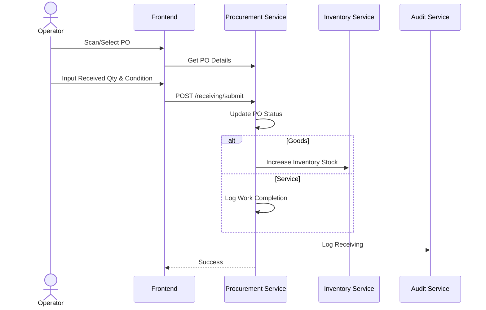

**Alternative Flows**:
*   **A1 Partial Acceptance**: Received quantity < PO quantity. Status -> `PARTIALLY_ACCEPTED`.
*   **A2 Return**: Goods damaged/wrong match. Status -> `RETURNED`.
*   **A3 Service Rejection**: Result mismatch. Status -> `REJECTED`.

**Error Flows**:
*   **E1 No Documents**: Delivery Order/Report missing.
*   **E2 Mismatch**: PO items differ from Physical documents.
*   **E3 Status Update Failure**: Failed to update PO status.
*   **E4 Inventory Sync Failure**: Failed to update stock (Pending Update flagged).
*   **E5 Audit Failure**: Failed to log activity (Local log saved).

---

### 1.6 Procurement Reports (Operator)
**Description**: Generating reports on PRs, POs, Realization vs Budget, Lead Time, Stock, Vendor Performance.
**Details**:
*   **Filters**: Period, Vendor, Location, Status, Category.
*   **Output**: On-screen table/charts, Export to PDF/Excel.

**Sequence Diagram**:
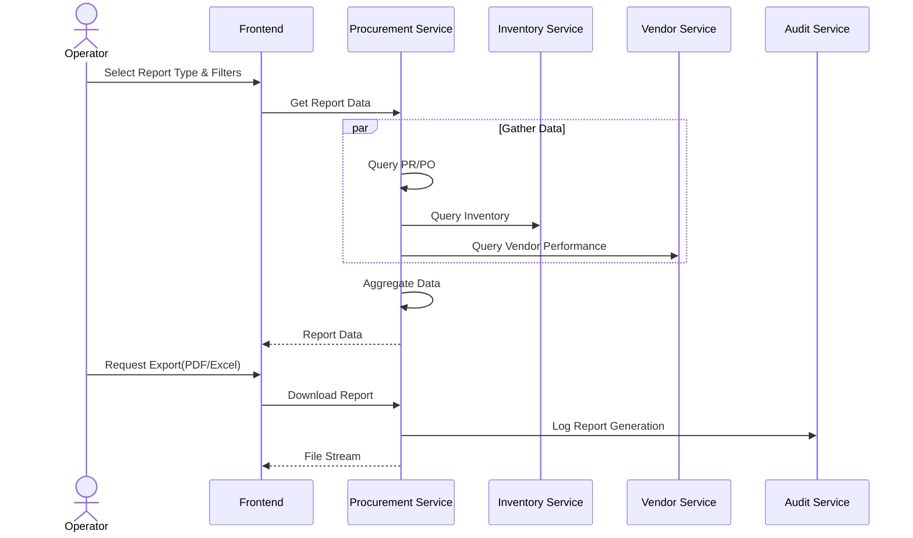

**Error Flows**:
*   **E1 No Data**: No records match the filter.
*   **E2 Partial Data**: One service failed to respond (Incomplete flag).
*   **E3 Export Failure**: PDF/Excel generation failed.
*   **E4 Timeout**: Complex filter exceeded processing time limit.

---

### 1.7 Operator Dashboard
**Description**: Real-time summary of procurement status.
**Content**:
*   Counts: PR Draft/Submitted, PR Waiting Approval, Active POs.
*   Alerts: Stock Minimum, High Priority Notifications.
*   Quick Actions: Create PR, View Inventory.

**Sequence Diagram**:
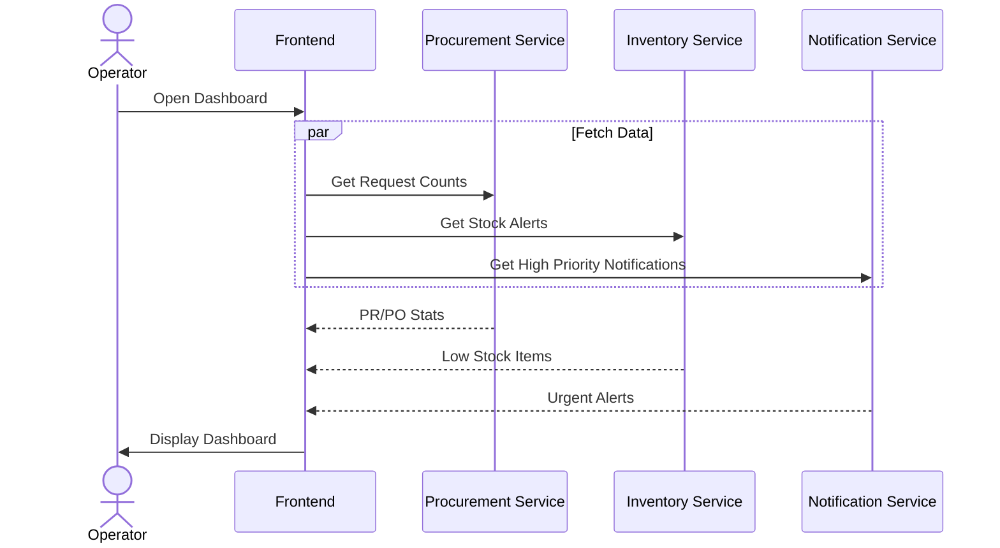

**Error Flows**:
*   **E1 Load Failure**: Dashboard data failed to load (Procurement/Inventory Service down).
*   **E2 Notification Failure**: Failed to load notifications.
*   **E3 Graph Failure**: Metric calculation failed (Fallback table shown).

---

### 1.8 Operator Notifications
**Description**: Manage alerts for approvals, deadlines, stock levels.
**Actions**: Mark as Read, Archive, Filter (by type), Preferences (Email/Push/Dashboard).

**Sequence Diagram**:
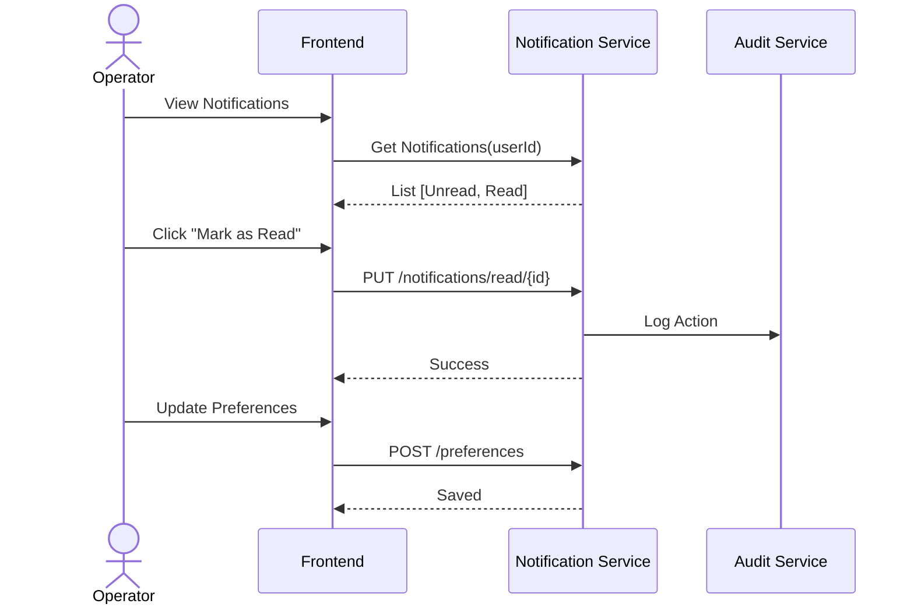

**Error Flows**:
*   **E1 Load Failure**: Failed to fetch notifications.
*   **E2 Preference Save Failure**: Service failed to save settings.
*   **E3 Partial Bulk Fail**: Some items failed to update status.
*   **E4 Expired Data**: Notification references old/deleted data (>30 days).

---

### 1.9 Audit Trail & History (Operator)
**Description**: View transaction history and status changes for PR/PO.
**Features**:
*   Timeline of changes (Created -> Submitted -> Approved).
*   Who performed actions.
*   Compare Versions (e.g., original vs revised).

**Sequence Diagram**:
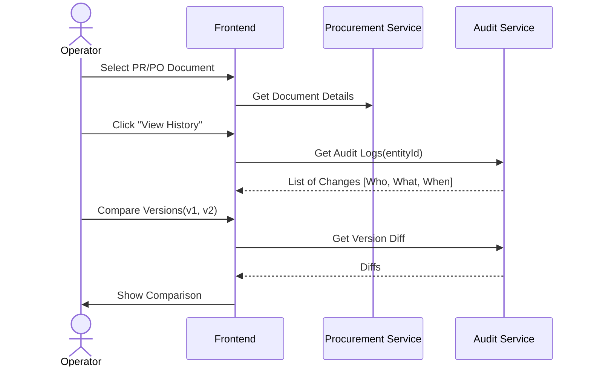

**Error Flows**:
*   **E1 History Not Found**: No history for selected document.
*   **E2 Log Fetch Failure**: Audit Service unresponsive.
*   **E3 Invalid Document**: Document deleted or expired.
*   **E4 Export Failure**: CSV download failed.

---

## 2. Supervisor Use Cases

### 2.1 Approve Procurement Request (Memberikan Persetujuan)
**Description**: Supervisor reviews Submitted PRs and makes a decision.
**Actor**: Supervisor

**Basic Flow**:
1.  View list of "Submitted" PRs for assigned locations.
2.  Review details (Vendor, Items, Cost, Priority).
3.  **Action**:
    *   **Approve**: PR becomes Approved -> PO creation process starts.
    *   **Reject**: PR closed.
    *   **Return**: Sent back to Operator for revision.
    *   **Comment**: Add feedback without status change.
4.  System notifies Operator.

**Sequence Diagram**:
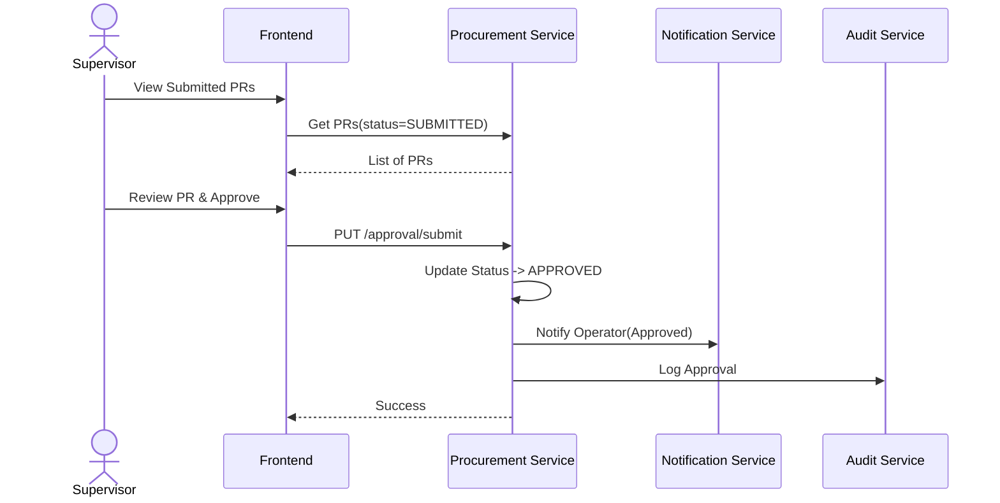

**Alternative Flows**:
*   **A4 Auto-Escalation**: If no decision in 48h, escalated to Admin.

**Error Flows**:
*   **E1 Status Changed**: Request already processed by another Supervisor/Admin.
*   **E2 Save Failure**: Failed to save decision.
*   **E3 Notification Failure**: Failed to notify Operator (Retry logic).
*   **E4 Audit Failure**: Audit logging failed (Pending sync).

---

### 2.2 Supervisor Reports
**Description**: High-level reports for management.
**Types**:
*   Budget Evaluation.
*   Operator Performance.
*   Inventory per Location.
*   Service History.
*   **Analytics Dashboard (Trends, Lead Time, Vendor KPIs).

**Sequence Diagram**:
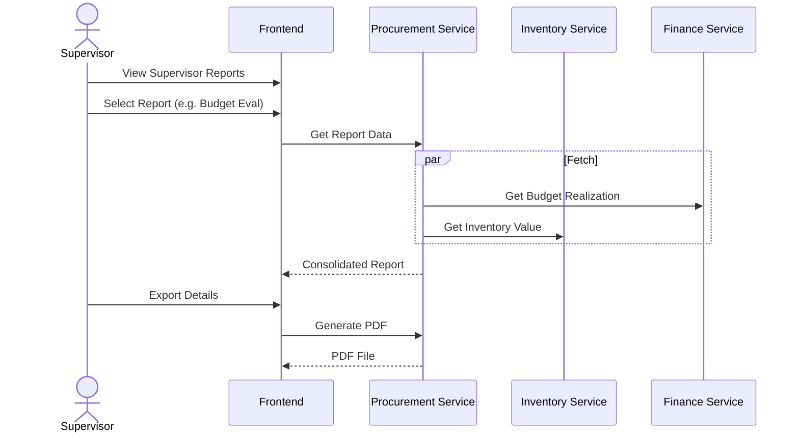

**Error Flows**:
*   **E1 No Data**: No records found for selected period/filter.
*   **E2 Partial Data**: Service timeout for one of the data sources.
*   **E3 Export Failure**: Failed to render PDF/Excel.
*   **E4 Schedule Failure**: Automatic report scheduling failed to save.

---

### 2.3 Budget Allocation Management (Mengatur Alokasi Anggaran)
**Description**: Monitor Operator budget usage and request Top-Ups.
**Constraint**: Supervisor cannot *reduce* budget, only request *additions*.

**Basic Flow**:
1.  View Operator list with budget usage %.
2.  Select Operator nearing limit (Warning/Reference).
3.  Click "Request Top-Up".
4.  Enter Amount and Reason.
5.  Submit to Finance Service.

**Sequence Diagram**:
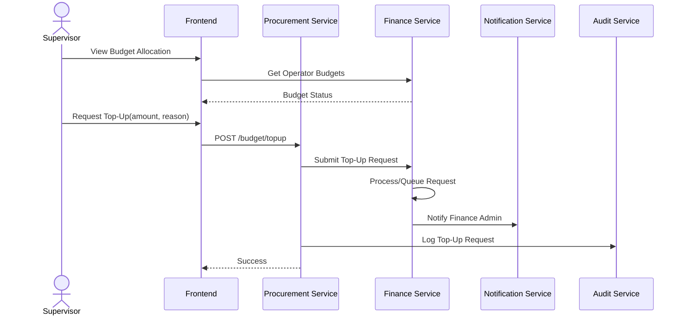

**Error Flows**:
*   **E1 Load Failure**: Budget data failed to retrieve from Finance.
*   **E2 Invalid Amount**: Top-up amount 0 or exceeds max limit.
*   **E3 Save Failure**: Request failed to submit.
*   **E4 Notification Failure**: Finance Service unreachable for notification.

---

### 2.4 Set Procurement Priority
**Description**: Adjust urgency of PRs.
**Options**: Normal, Important, Urgent.
**Effect**: Updates workflow priority and notifies Operator.

**Sequence Diagram**:
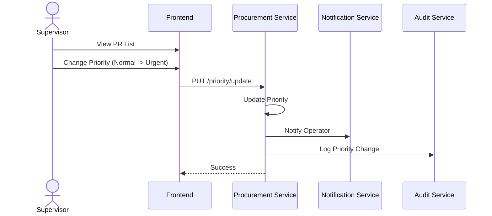

**Error Flows**:
*   **E1 Access Denied**: Supervisor not assigned to this location.
*   **E2 Save Failure**: Priority update failed.
*   **E3 Data Conflict**: Concurrent update detected.
*   **E4 Notification Failure**: Notification to Operator failed.

---

### 2.5 Supervisor Dashboard & Analytics
**Description**: Visual metrics for decision making.
**Metrics**:
*   Monthly Trend (PR/PO volume).
*   Budget Realization.
*   Vendor Performance (On-time vs Late).
*   **Average Lead Time.

**Sequence Diagram**:
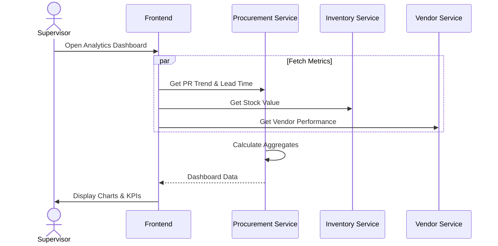

**Error Flows**:
*   **E1 Service Failure**: Data sources (Procurement/Inventory/Finance) unreachable.
*   **E2 Incomplete Data**: Historical data missing for a location.
*   **E3 Graph Failure**: Rendering error (Fallback to table).
*   **E4 Export Failure**: Dashboard export failed.

---

### 2.6 Supervisor Notifications
**Description**: Managing approvals, deadline alerts, and budget warnings.
**Actions**: Read, Archive, Configure Preferences.

**Sequence Diagram**:
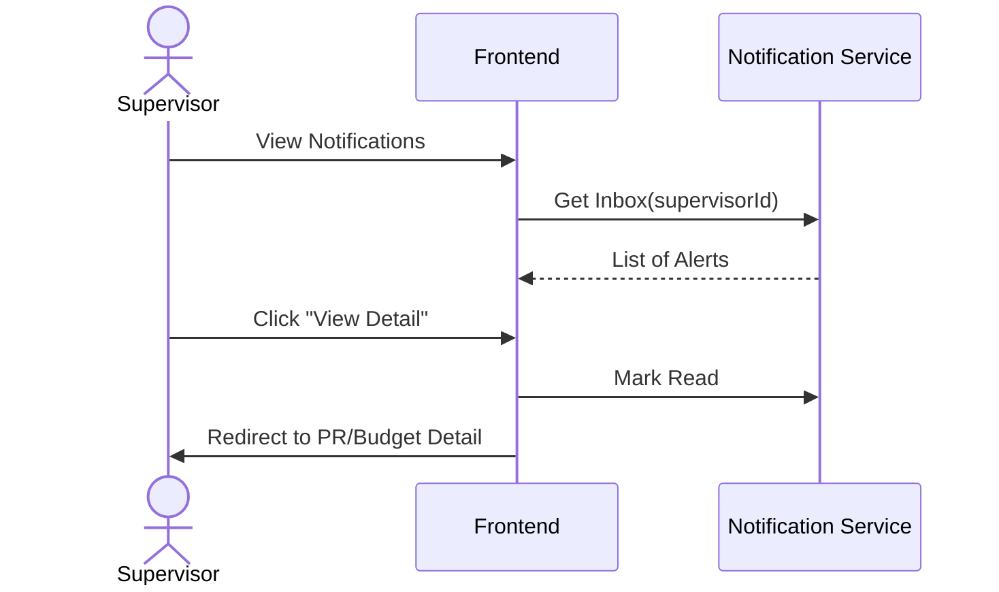

**Error Flows**:
*   **E1 Load Failure**: Notifications failed to load.
*   **E2 Save Failure**: Preference settings failed to save.
*   **E3 Sync Failure**: Status update (read/unread) failed to sync.
*   **E4 Duplication**: Duplicate notifications detected and merged.

---

### 2.7 Supervisor Audit & History
**Description**: Review team's transaction history, logs, and document versions.

**Sequence Diagram**:
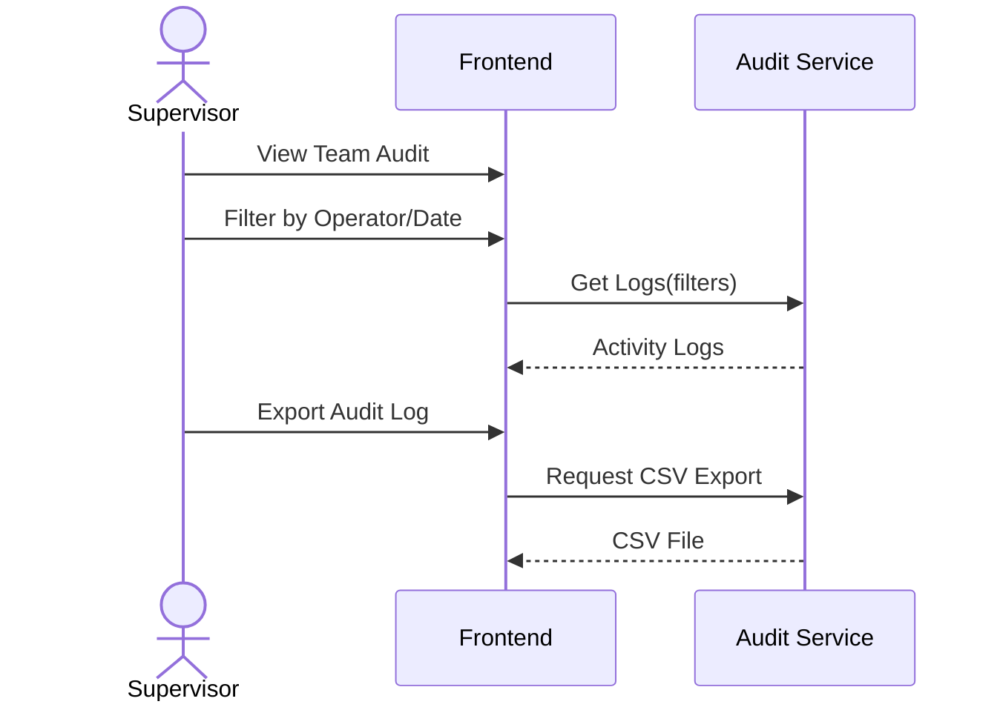

**Error Flows**:
*   **E1 No Data**: No audit logs found for filter.
*   **E2 Service Failure**: Audit Service down.
*   **E3 Version Missing**: Document version comparison unavailable.
*   **E4 Export Failure**: Audit report export failed.
