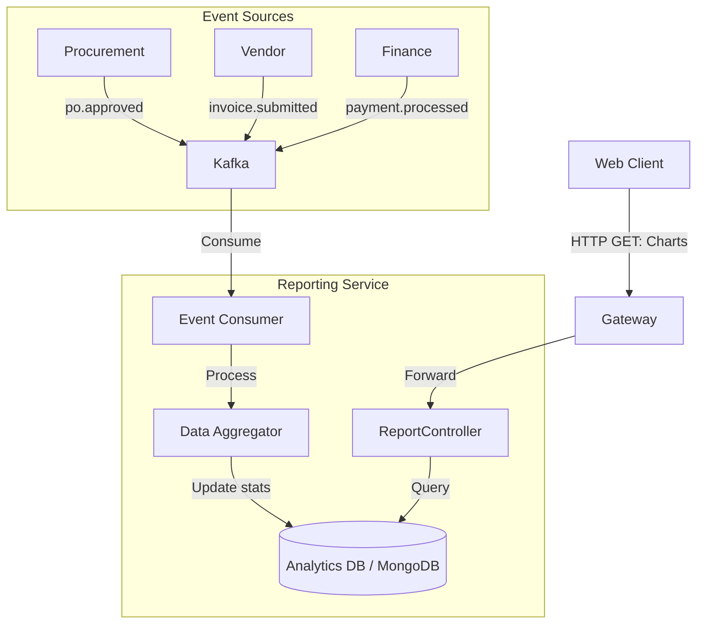

# Reporting Service - Architecture

## High-Level Diagram

The Reporting Service implements a **CQRS (Command Query Responsibility Segregation)** pattern. It maintains its own read-optimized database, populated by listening to domain events.

## Data Model (Read Models)

### MonthlySpend
*   `id`: `2025-12`
*   `totalAmount`: Decimal
*   `byCategory`: Map<String, Decimal>
*   `byDepartment`: Map<String, Decimal>

### VendorStats
*   `vendorId`: UUID
*   `totalOrders`: Integer
*   `onTimeDeliveryRate`: Percentage
*   `averageRating`: Float
