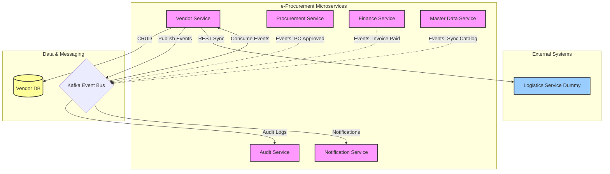

# Vendor Service Architecture

## 1. Overview
The Vendor Service satisfies the requirements for vendor interaction within the e-Procurement ecosystem. It is designed as a microservice using Spring Boot.

## 2. Components

### 2.1 Layered Architecture
- **Controller Layer**: Handles REST API requests (e.g., `RFQController`, `CatalogController`).
- **Service Layer**: Contains business logic (e.g., `RFQService`, `CatalogService`).
- **Repository Layer**: Data access using Spring Data JPA (`projections` and `specifications` may be used).
- **Domain Layer**: JPA Entities representing the database schema.

### 2.2 Integration
- **Kafka**: Event-driven communication.
    - **Producers**: `RFQProducer`, `InvoiceProducer`, `CatalogProducer`, `NotificationProducer`.
    - **Consumers**: `AdminEventConsumer`, `UserEventConsumer`, `LogisticsConsumer`.
- **Feign Client**: `LogisticsClient` for interacting with the external Logistics Service (dummy).

## 3. Data Model

### 3.1 Logical Schema
- **VendorAccount**: `id`, `name`, `status`, `rating`.
- **VendorCatalogItem**: `id`, `vendor_id`, `sku`, `price`, `stock`.
- **RFQ**: External entity reference, locally managed status in context of Vendor.
- **Quotation**: `id`, `rfq_id`, `vendor_id`, `items`, `total_price`.
- **Delivery**: `id`, `po_id`, `tracking_number`, `status`.
- **Invoice**: `id`, `po_id`, `amount`, `status`.

## 4. Key Workflows

### 4.1 RFQ Response
1. `RFQController` receives `GET /open`.
2. Vendor submits quotation via `POST /api/vendor/quotation/{rfqId}`.
3. `QuotationService` validates and saves.
4. `RFQProducer` publishes event `vendor.quotation.submitted`.

### 4.2 Catalog Sync
1. Vendor updates item.
2. `CatalogService` saves to DB.
3. `CatalogProducer` publishes `vendor.catalog.updated`.
4. Master Data Service consumes this to update the central catalog.

### 4.3 Invoice Generation
1. Vendor requests invoice generation for a PO.
2. `InvoiceService` validates PO status.
3. `InvoiceService` calculates tax and total.
4. `InvoiceService` creates a Draft Invoice.

## 5. Security
- **Authentication**: JWT Barrier Token.
- **Authorization**: Role-Based (Vendor only for most endpoints).
- **Soft Delete**: Data is not physically deleted; `deleted_at` flag is used.

## 6. High-Level Architecture Diagram

