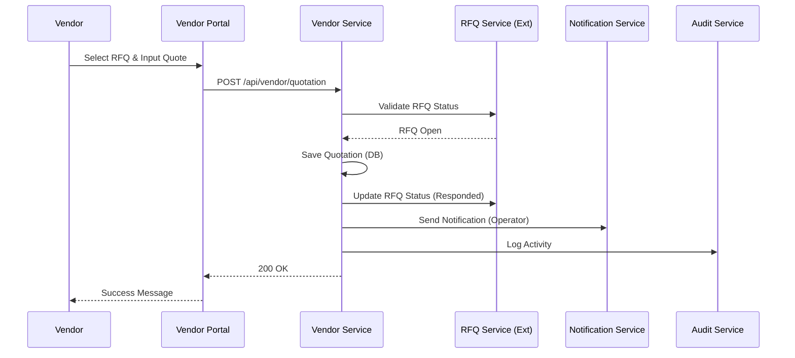
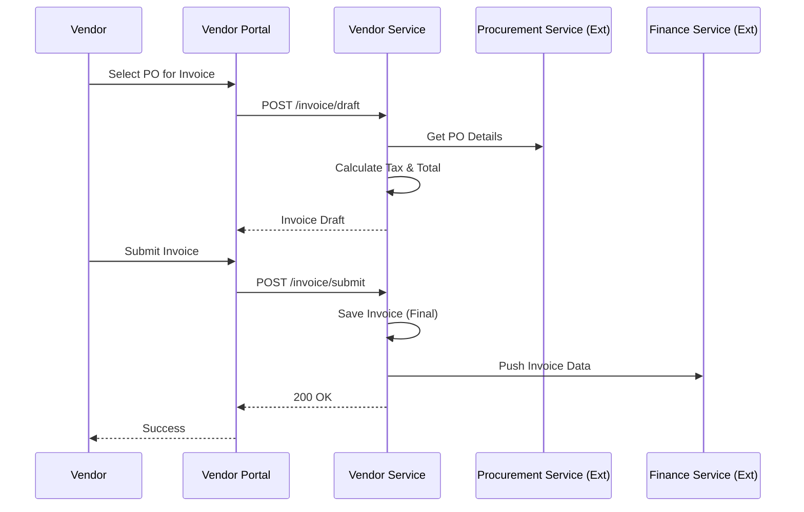
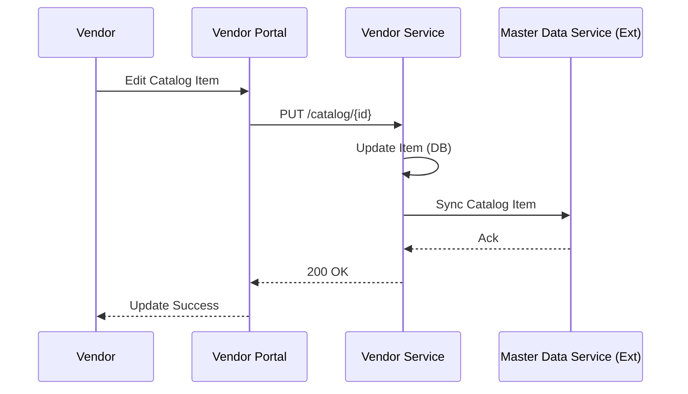
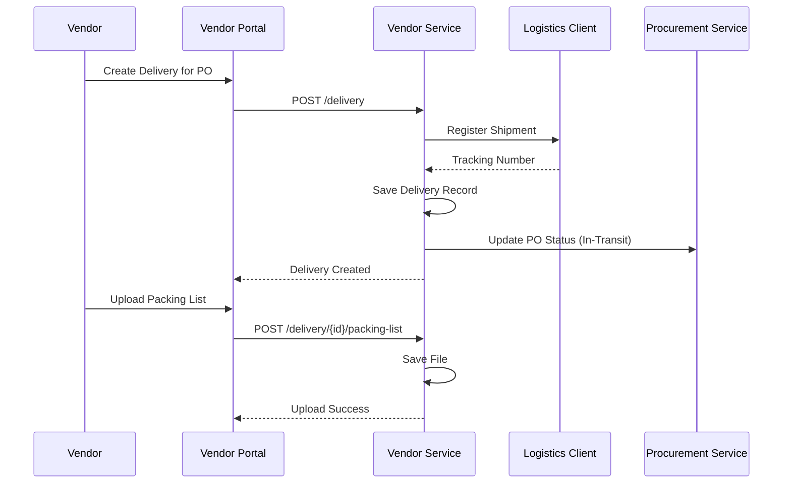
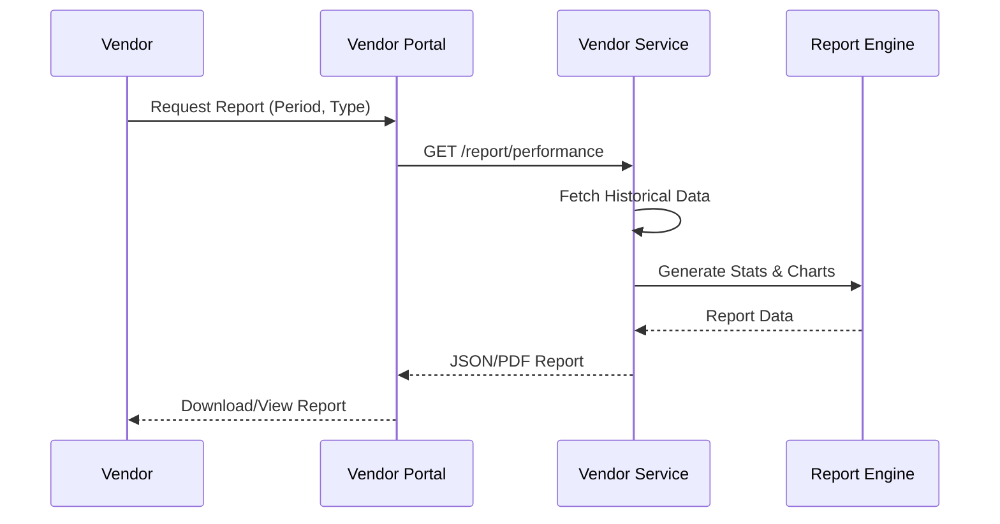

# Vendor Service Use Cases

## 1. Menanggapi Permintaan Penawaran (RFQ)

**Deskripsi**: Vendor meninjau RFQ yang dikirim oleh sistem dan mengirimkan respon penawaran (QuotationResponse).

- **Aktor**: Vendor
- **Pre-Kondisi**: Vendor login, RFQ status Open.
- **Post-Kondisi**: QuotationResponse tersimpan, Status RFQ "Responded".

**Basic Flow**:
1. Vendor membuka modul “RFQ Masuk”.
2. Sistem menampilkan daftar RFQ Open.
3. Vendor memilih RFQ.
4. Sistem menampilkan detail item (Read-Only).
5. Vendor mengisi harga, lead time, dan catatan.
6. Vendor menekan “Kirim Penawaran”.
7. Sistem mengubah status RFQ menjadi "Responded" dan notifikasi terkirim.

**Alternative Flow**:
- **Revisi Penawaran**: Jika ada feedback, vendor dapat merevisi harga/lead time.
- **Tolak RFQ**: Vendor memilih "Tolak", mengisi alasan. Status RFQ menjadi "Declined".
- **Minta Klarifikasi**: Vendor mengirim pertanyaan teknis ke Operator.

**Error Flow**:
- **E1: RFQ Kedaluwarsa**: Vendor membuka RFQ setelah tenggat. Sistem menolak input dan menandai Expired.
- **E2: Format Harga Tidak Valid**: Vendor mengisi harga negatif/salah format. Sistem menolak.
- **E3: Gagal Simpan Respons**: Gangguan penyimpanan. Sistem meminta retry.
- **E4: Notifikasi Gagal Terkirim**: Penawaran tersimpan, notifikasi gagal. Sistem retry, jika tetap gagal log error di Audit.

**Sequence Diagram**:



## 2. Melihat Dashboard Vendor

**Deskripsi**: Vendor memantau kinerja dan aktivitas terkini (RFQ masuk, PO aktif, Invoice outcome).

- **Aktor**: Vendor
- **Pre-Kondisi**: Login berhasil.

**Basic Flow**:
1. Vendor membuka Dashboard.
2. Sistem menampilkan widget: RFQ Open, PO Aktif, Status Pengiriman, Invoice Outstanding, KPI (On-time rate).
3. Vendor dapat klik widget untuk navigasi ke modul terkait.

**Alternative Flow**:
- **Filter Waktu**: Vendor memilih periode (mingguan/bulanan).
- **Drill-down**: Detail pengiriman live (Logistics Dummy).
- **Insight**: Sistem menyorot anomali (mis: retur naik).

**Error Flow**:
- **E1: Data Sebagian Tidak Tersedia**: Service down (Procurement/Finance). Dashboard tampil parsial dengan banner peringatan.
- **E2: Grafik Gagal Dirender**: Fallback ke tampilan tabel.
- **E3: Integrasi Logistics Gagal**: Status tracking cached ditampilkan, notifikasi "Live tracking unavailable".
- **E4: Export Gagal**: Gagal download file KPI.

**Sequence Diagram**:
```mermaid
sequenceDiagram
    participant Vendor
    participant Frontend as Vendor Portal
    participant VS as Vendor Service
    participant RFQ as RFQ Service (Ext)
    participant Logs as Logistics Service (Mock)
    participant Fin as Finance Service (Ext)

    Vendor->>Frontend: Load Dashboard
    Frontend->>VS: GET /dashboard/summary
    parallel Fetch Data
        VS->>RFQ: Get Open RFQs & POs
        VS->>Logs: Get Live Delivery Status
        VS->>Fin: Get Invoice Stats
    end
    VS->>VS: Aggregate Data
    VS-->>Frontend: Dashboard DTO
    Frontend-->>Vendor: Display Charts & Widgets
```


## 3. Generate Invoice oleh Sistem

**Deskripsi**: Sistem membuat draft invoice otomatis berdasarkan PO dan termin.

- **Aktor**: Vendor
- **Pre-Kondisi**: PO Approved / Termin Approved.

**Basic Flow**:
1. Vendor membuka modul Invoice.
2. Vendor memilih PO/Termin yang siap ditagih.
3. Sistem menghitung subtotal dan PPN, membuat Draft Invoice.
4. Vendor meninjau draft, menambah catatan/lampiran.
5. Vendor Submit Invoice.
6. Status Invoice menjadi "Submitted to Finance".

**Alternative Flow**:
- **Multiple Termin**: Jika PO bertahap, invoice dibuat per termin.
- **Lampiran**: Vendor upload surat jalan/dokumen pendukung.

**Error Flow**:
- **E1: Tidak Ada PO Tersedia**: Tidak ada dokumen status Approved yg bisa ditagih.
- **E2: Gagal Generate Invoice**: Error perhitungan/PDF gen. User diminta retry.
- **E3: Unggah Lampiran Gagal**: Size/format limit exceeded.
- **E4: Notifikasi Finance Gagal**: Invoice tetap submitted, log failure.

**Sequence Diagram**:



## 4. Mengelola Katalog Barang dan Jasa

**Deskripsi**: Vendor memaintain database produk/jasa mereka.

- **Aktor**: Vendor
- **Post-Kondisi**: Katalog terupdate, sinkron ke Master Data.

**Basic Flow**:
1. Vendor pilih menu "Kelola Katalog".
2. Vendor memilih Tambah/Edit/Hapus.
3. Input data (Nama, SKU, Harga, Stok).
4. Simpan.
5. Sistem menyinkronkan data ke Master Data Service.

**Alternative Flow**:
- **Mass Update**: Vendor mengupload/edit banyak item sekaligus.
- **Variasi**: Menambah varian (warna/ukuran) per item.

**Error Flow**:
- **E1: Format Harga Invalid**: Input negatif/huruf.
- **E2: Duplikasi SKU**: SKU sudah ada di katalog vendor.
- **E3: Gagal Sinkronisasi**: Disimpan lokal, status sync_pending. Background retry.
- **E4: Hapus Item Terpakai**: Item ada di PR/PO aktif. Tolak hapus -> saran Nonaktifkan.

**Sequence Diagram**:



## 5. Pengelolaan Pengiriman (Delivery)

**Deskripsi**: Vendor membuat jadwal pengiriman dan mengunggah dokumen jalan.

- **Aktor**: Vendor
- **Pre-Kondisi**: PO Approved.

**Basic Flow**:
1. Vendor pilih PO.
2. Vendor buat "Delivery Order" (Jadwal, Provider).
3. Sistem tracking via Logistics Client.
4. Vendor upload Packing List.
5. Status Pengiriman "In-Transit".

**Alternative Flow**:
- **Pengiriman Parsial**: Kirim sebagian item PO.
- **Upload POD**: Bukti serah terima setelah sampai.

**Error Flow**:
- **E1: Logistics Service Down**: Gagal dapatkan tracking ID. Retry/Manual input.
- **E2: Packing List Gagal Upload**: Size limit.
- **E3: Parsial Invalid**: Item tidak ada di PO.
- **E4: POD Gagal Simpan**: Error storage.

**Sequence Diagram**:



## 6. Membuat Laporan Vendor

**Deskripsi**: Vendor menarik laporan historis transaksi dan performa.

- **Aktor**: Vendor

**Basic Flow**:
1. Vendor pilih menu Laporan.
2. Pilih filter (Periode, Status).
3. Generate Report (tampil di layar).
4. Export ke PDF/Excel.

**Alternative Flow**:
- **Jadwal Otomatis**: Email report mingguan/bulanan.
- **Drill-down**: Klik grafik untuk detail transaksi.

**Error Flow**:
- **E1: Data Tidak Ditemukan**: Filter tidak match result apapun.
- **E2: Service Timeout**: Salah satu sumber data timeout. Tampil parsial.
- **E3: Export Gagal**: File corrupt/timeout.
- **E4: Gagal Simpan Jadwal**: Database error.

**Sequence Diagram**:



