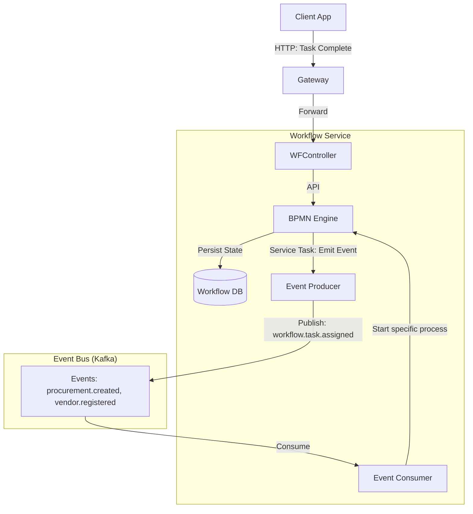

# Workflow Service - Architecture

## High-Level Diagram

The Workflow Service operates as an orchestration engine that reacts to domain events to start processes, and emits events when tasks are completed.

## Component Description

### 1. BPMN Engine
*   **Role**: Core state machine.
*   **Technology**: Camunda / Flowable / Activiti (Embedded).
*   **Responsibility**:
    *   Parses BPMN 2.0 XML files.
    *   Maintains token state (where in the process we are).
    *   Handles timers and retries.

### 2. Workflow DB
*   **Role**: Specialized DB for the engine.
*   **Tables**: `ACT_RU_TASK`, `ACT_RU_EXECUTION`, `ACT_RE_PROCDEF`.

## Integration Pattern
*   **User Tasks**: Engine waits for human input via API.
*   **Service Tasks**: Engine publishes event or calls external service (synch/async).

## Process Definition Example (BPMN)
*   **Start** -> **User Task** (Approve) -> **Gateway** (XOR)
    *   -> **Service Task** (Update Status to APPROVED) -> **End**
    *   -> **Service Task** (Send Rejection Email) -> **End**
