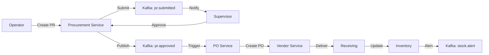

# Procurement Service

> **Enterprise Procurement Management Microservice** - Complete procurement lifecycle from request to delivery, with integrated inventory management and event-driven architecture.

[](https://spring.io/projects/spring-boot)
[](https://openjdk.java.net/)
[](LICENSE)

---

## 📋 Table of Contents

- [Overview](#overview)
- [Features](#features)
- [Architecture](#architecture)
- [Tech Stack](#tech-stack)
- [Getting Started](#getting-started)
- [API Documentation](#api-documentation)
- [Configuration](#configuration)
- [Development](#development)
- [Testing](#testing)
- [Deployment](#deployment)
- [Documentation](#documentation)

---

## 🎯 Overview

The **Procurement Service** is a core microservice in the e-Procurement ecosystem, managing the complete procurement workflow:

- **Procurement Requests (PR)**: Create, submit, and track procurement requests
- **Approval Workflow**: Multi-level approval with supervisor review
- **Purchase Orders (PO)**: Auto-generate POs from approved PRs
- **Goods Receiving**: Track deliveries and update inventory
- **Service Management**: Monitor service progress and payment milestones
- **Inventory Control**: Real-time stock tracking with automated alerts
- **Audit & Reporting**: Complete activity history and analytics dashboards

---

## ✨ Features

### For Operators
- ✅ Create and manage procurement requests
- ✅ Submit PRs for approval with priority levels
- ✅ Track PR status in real-time
- ✅ Review and accept service termins
- ✅ Receive goods with quality checks
- ✅ View personal dashboard with statistics

### For Supervisors
- ✅ Review and approve/reject PRs
- ✅ Provide feedback and request revisions
- ✅ Escalate urgent requests
- ✅ Monitor approval SLAs
- ✅ View team performance metrics

### System Features
- ✅ Event-driven architecture with Kafka
- ✅ Automated inventory updates
- ✅ Stock level alerts
- ✅ Soft delete for data retention
- ✅ Complete audit trail
- ✅ RESTful API with Swagger docs

---

## 🏗️ Architecture

### Domain-Driven Design (DDD)

```
procurement-service/
├── domain/
│   ├── procurementrequest/    # PR management
│   ├── approval/               # Approval workflow
│   ├── purchaseorder/          # PO generation
│   ├── receiving/              # Goods receiving
│   ├── serviceprogress/        # Service tracking
│   ├── servicetermin/          # Payment milestones
│   ├── inventory/              # Stock management
│   ├── dashboard/              # Analytics
│   └── audit/                  # Activity logging
├── common/                     # Shared utilities
├── event/                      # Kafka producers/consumers
└── client/                     # Feign integrations
```

### Event Flow



---

## 🛠️ Tech Stack

| Category | Technology |
|----------|-----------|
| **Framework** | Spring Boot 4.0.0 |
| **Language** | Java 22 |
| **Database** | PostgreSQL 15+ |
| **Migration** | Flyway |
| **Messaging** | Apache Kafka |
| **Cache** | Redis (Lettuce) |
| **API Docs** | Swagger/OpenAPI 3 |
| **Mapping** | MapStruct 1.6.3 |
| **Testing** | JUnit 5, Mockito, Testcontainers |
| **Build** | Maven 3.9+ |

---

## 🚀 Getting Started

### Prerequisites

- Java 22+
- Maven 3.9+
- Docker & Docker Compose
- PostgreSQL 15+
- Apache Kafka 3.x
- Redis 7+

### Quick Start

1. **Clone the repository**
```bash
cd procurement-service
```

2. **Start infrastructure services**
```bash
docker-compose up -d postgres kafka redis
```

3. **Build the project**
```bash
mvn clean install -DskipTests
```

4. **Run the service**
```bash
mvn spring-boot:run
```

5. **Access Swagger UI**
```
http://localhost:8083/swagger-ui.html
```

---

## 📚 API Documentation

### Base URL
```
http://localhost:8083
```

### Key Endpoints

#### Operator - Procurement Requests
```http
POST   /api/operator/procurement/requests          # Create PR
PUT    /api/operator/procurement/requests/{id}     # Update PR
PUT    /api/operator/procurement/requests/{id}/submit  # Submit PR
GET    /api/operator/procurement/requests          # List PRs
GET    /api/operator/procurement/requests/{id}     # Get PR details
DELETE /api/operator/procurement/requests/{id}     # Delete PR
```

#### Supervisor - Approvals
```http
GET /api/supervisor/approvals/pending              # Pending approvals
GET /api/supervisor/approvals/pr/{prId}            # PR for review
PUT /api/supervisor/approvals/pr/{prId}/approve    # Approve PR
PUT /api/supervisor/approvals/pr/{prId}/reject     # Reject PR
PUT /api/supervisor/approvals/pr/{prId}/return     # Return for revision
PUT /api/supervisor/approvals/pr/{prId}/feedback   # Add feedback
```

#### Dashboards
```http
GET /api/operator/dashboard                        # Operator dashboard
GET /api/supervisor/dashboard                      # Supervisor dashboard
```

**Total Endpoints**: 29 across 7 controllers

📖 **Full API Documentation**: [API_DOCUMENTATION.md](./docs/API_DOCUMENTATION.md)

---

## ⚙️ Configuration

### Application Properties

```properties
# Server
server.port=8083
spring.application.name=procurement-service

# Database
spring.datasource.url=jdbc:postgresql://localhost:5432/procurement_db
spring.datasource.username=postgres
spring.datasource.password=postgres

# Flyway
spring.flyway.enabled=true
spring.flyway.baseline-on-migrate=true

# JPA
spring.jpa.hibernate.ddl-auto=validate
spring.jpa.show-sql=false

# Kafka
spring.kafka.bootstrap-servers=localhost:9092
spring.kafka.consumer.group-id=procurement-service
spring.kafka.consumer.auto-offset-reset=earliest

# Redis
spring.data.redis.host=localhost
spring.data.redis.port=6379

# Feign Clients
integration.inventory-service.url=http://localhost:8086

# Swagger
springdoc.api-docs.path=/api-docs
springdoc.swagger-ui.path=/swagger-ui.html
```

### Environment Variables

```bash
export DB_HOST=localhost
export DB_PORT=5432
export DB_NAME=procurement_db
export KAFKA_BOOTSTRAP_SERVERS=localhost:9092
export REDIS_HOST=localhost
```

---

## 💻 Development

### Project Structure

```
src/
├── main/
│   ├── java/com/tugas_akhir/procurement_service/
│   │   ├── domain/              # Business domains
│   │   ├── common/              # Shared code
│   │   ├── event/               # Kafka events
│   │   ├── client/              # Feign clients
│   │   └── ProcurementServiceApplication.java
│   └── resources/
│       ├── application.properties
│       └── db/migration/        # Flyway scripts
└── test/
    ├── java/                    # Unit & integration tests
    └── resources/
        └── application-test.properties
```

### Code Style

- **Naming**: CamelCase for classes, camelCase for methods
- **Packages**: Domain-based organization
- **DTOs**: Separate request/response DTOs
- **Mappers**: MapStruct for entity-DTO conversion
- **Exceptions**: Custom exceptions with error codes

### Adding a New Domain

1. Create domain package: `domain/newdomain/`
2. Add subpackages: `entity/`, `repository/`, `service/`, `controller/`, `dto/`, `mapper/`
3. Implement entity with JPA annotations
4. Create repository interface
5. Implement service with business logic
6. Add controller with REST endpoints
7. Create Flyway migration script
8. Update documentation

---

## 🧪 Testing

### Run All Tests
```bash
mvn test
```

### Run Specific Test
```bash
mvn test -Dtest=ProcurementRequestServiceTest
```

### Skip Tests
```bash
mvn clean install -DskipTests
```

### Test Coverage

- **Unit Tests**: Service layer logic
- **Integration Tests**: Controller → Database flow (Testcontainers)
- **Current Coverage**: ~70% service layer

### Test Structure

```
src/test/java/
├── domain/
│   ├── inventory/service/
│   │   └── InventoryDomainServiceTest.java
│   └── procurementrequest/service/
│       └── ProcurementRequestServiceTest.java
├── integration/
│   └── ProcurementRequestIntegrationTest.java
├── TestDataFactory.java
├── TestcontainersConfiguration.java
└── AbstractIntegrationTest.java
```

---

## 🚢 Deployment

### Docker Build

```bash
docker build -t procurement-service:1.0.0 .
```

### Docker Run

```bash
docker run -d \
  -p 8083:8083 \
  -e DB_HOST=postgres \
  -e KAFKA_BOOTSTRAP_SERVERS=kafka:9092 \
  --name procurement-service \
  procurement-service:1.0.0
```

### Docker Compose

```yaml
version: '3.8'
services:
  procurement-service:
    build: .
    ports:
      - "8083:8083"
    environment:
      DB_HOST: postgres
      KAFKA_BOOTSTRAP_SERVERS: kafka:9092
    depends_on:
      - postgres
      - kafka
      - redis
```

---

## 📖 Documentation

| Document | Description |
|----------|-------------|
| [API_DOCUMENTATION.md](./docs/API_DOCUMENTATION.md) | Complete API reference with 29 endpoints |
| [DATABASE.md](./docs/DATABASE.md) | Database schema and relationships |
| [DOCUMENTATION.md](./docs/DOCUMENTATION.md) | Architecture and technical overview |
| [USE_CASES.md](./docs/USE_CASES.md) | Business use cases and workflows |
| [walkthrough.md](./docs/walkthrough.md) | Implementation walkthrough |

---

## 📊 Status

**Current Version**: 1.0.0  
**Status**: ✅ **READY FOR DEVELOPMENT**

### Implemented Features
- ✅ All 5 phases completed
- ✅ 29 API endpoints
- ✅ Event-driven integration
- ✅ Inventory management
- ✅ Dashboard analytics
- ✅ Audit logging

### Pending
- ⚠️ Integration test fixes
- ⚠️ Circuit breaker implementation
- ⚠️ Advanced reporting queries

---

## 🤝 Contributing

1. Follow DDD architecture patterns
2. Write unit tests for new services
3. Update Swagger annotations
4. Create Flyway migration for schema changes
5. Update documentation

---

## 📝 License

This project is part of the e-Procurement thesis system.

---

## 📧 Contact

For questions or support, please refer to the project documentation or contact the development team.

---

**Built with ❤️ using Spring Boot and Domain-Driven Design**
